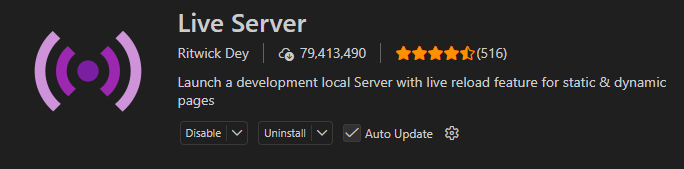

# Prototipo para un trabajo de universidad - verNombre
Se plantea el problema de que los peritos informaticos necesitan gestionar mejor sus tareas y seguimiento de las solicitudes que les llegan. Se identifican 4 usuarios (Administrador, Coordinador, Mesa de entrada y Perito informatico). De esta manera, organizan eficientemente sus responsabilidades, procedimientos, etc. 

# Tecnologias utilizadas
Se utilizaron las siguientes tecnologías: HTML, CSS y Javascript. El despliegue se hace a través de VScode, utilizando una extension llamada Live Server.

# Instalacion y configuracion
El proyecto se puede clonar desde el siguiente repositorio: https://github.com/MatBustamant/gestion-pericias-informaticas.git
Se precisa tener instalado VScode con anterioridad, mas la extension Live Server.

1. Crear carpeta y abrir Git Bash. El comando de clonacion: git clone https://github.com/MatBustamant/gestion-pericias-informaticas.git ./
2. Abrir VScode. Abrir la carpeta que contiene el proyecto.
3. Ejecutar Live Server.

# Funciones y caracteristicas principales
Las caracteristicas que tiene son muchas, las criticas son las siguientes:
<ol>
    <li> Vistas diferenciadas para los distintos usuarios</li>
    <li> Gestion de solicitudes (registro, consulta de solicitudes, vista general de las solicitudes)</li>
    <li> Consulta de solicitudes para los usuarios Coordinador, Perito informatico y Mesa de entrada</li>
    <li> Asignacion de peritos y vista de calendario para ver sus tareas a lo largo del tiempo</li>
    <li> Dashboard con analiticas, resumen del estado de solicitudes</li>
</ol>

# Pantallas principales

<h2> Pantalla inicial </h2>

Pantalla de inicio. Los usuarios pueden ingresar y hay distintas vistas de acuerdo al tipo de usuario.

<h3> Mesa de entrada </h3>

Mesa de entrada se encarga en dar de alta una solicitud, regitrandola, asignandole peritos y puede consultar sus estados y descripciones en general

<h3> Coordinador </h3>

Coordinador solo se encarga de consultar por las solicitudes

<h3> Perito informatico </h3>

Cada perito puede ver su solicitud a la cual fue asignado